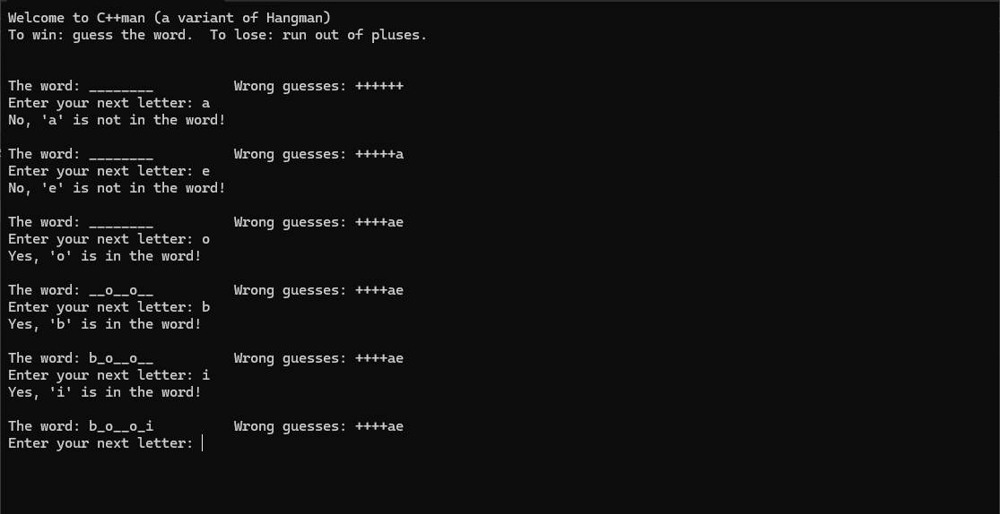

# C++man
A version of Hangman made in CPP, as a part of [LearnCpp.com's lessons.](https://www.learncpp.com/cpp-tutorial/chapter-16-summary-and-quiz/)

To play, download the release on Windows and launch the .exe file. Type in any letter and press enter to send in your guess. The underscores will be replaced with the correct letters, and the pluses (which represent your health) will be replaced with incorrect guesses. Guess the word correctly to win, and run out of pluses to lose. 

